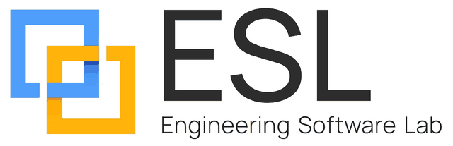

# Wazatator plugin for Claude Code



**By Engineering Software Lab (ESL)**, a member of Anthropic's Claude Partner Network.

Test and improve your Agent Skills (`SKILL.md`) from inside Claude Code. Wazatator runs your skill in real Claude Code sessions, grades what happened (the answer, the tool calls, the files), and tells you whether a skill edit actually helped: does the skill fire for the right prompts, does it lose prompts to your other installed skills, and does it beat Claude with no skill at all.

| Skill | What it does |
|---|---|
| `/wazatator:new-eval [skill]` | Creates an eval suite for a skill: realistic tasks, graders, trigger tests, and held-out tasks |
| `/wazatator:eval [skill or eval.yaml]` | Runs the suite, explains failures, and offers fixes that it keeps only if they pass a regression gate. Each attempt is logged to `skill-impact.md`, checked on held-out tasks, and reported with statistical significance and per-model transfer |
| `/wazatator:quality [skill]` | Static readiness check plus an LLM quality score for `SKILL.md` (clarity, trigger precision, scope, anti-patterns) |

Claude also uses these skills on its own when you ask it to test, benchmark, or review a skill.

## Requirements

- Claude Code, installed and logged in. The skills drive a local command-line tool, so they work in Claude Code only, not on claude.ai or in Cowork.
- The open-source `wazatator` CLI (MIT), set up separately. The plugin never fetches or sets it up; if it is missing, the skills stop and point you to the setup instructions at https://github.com/zuwasi/wazatator#installation. Prebuilt binaries for Windows, macOS, and Linux (x64 and ARM64) are published with SHA-256 checksums.

## Install

```
/plugin marketplace add zuwasi/wazatator-plugin
/plugin install wazatator@wazatator
```

## What the plugin runs and sends

The plugin contains only three skill files (Markdown instructions). It has no hooks, MCP servers, scripts, or binaries. When you use a skill, Claude runs these commands on your machine through its Bash tool, with your usual permission prompts:

- `wazatator run`, `check`, `quality`, `new eval`, `compare`, and `gate`, on the skill and eval folders you point it at.
- `wazatator run` and `quality` start child `claude -p` sessions in temporary folders. Those sessions use your Claude account and count against your plan or API bill like any other Claude Code session.
- The skills may create or edit files in your project: `eval.yaml`, task and fixture files, `results.json`, `skill-impact.md`, and, only after you accept a proposed fix, the `SKILL.md` under test (a fix that fails the gate is reverted).

The plugin itself sends no data anywhere. The `wazatator` CLI talks only to Claude Code on your machine, plus a once-a-day check of the GitHub releases API for a newer `wazatator` version, which you can turn off with `WAZA_NO_UPDATE_CHECK=1`.

## Cost

Every eval task and LLM-judged grader is a real Claude Code session. Keep `trials_per_task: 1` while iterating, and use 3 or more when you need a statistically significant result.

## Links

- Product overview: https://zuwasi.github.io/Public-html-pages/wazatator/
- CLI source, documentation, and releases: https://github.com/zuwasi/wazatator
- Issues with the plugin: https://github.com/zuwasi/wazatator-plugin/issues

## About ESL

Since 2005, Engineering Software Lab (ESL) has helped software teams adopt leading development tools: code analysis, testing, compliance, and AI coding agents. As a Claude Partner Network member, ESL helps teams adopt Claude and Claude Code, and builds open tools like Wazatator to make AI agents measurable.

- Web: https://eswlab.com
- Email: sales@eswlab.com
- LinkedIn: https://www.linkedin.com/company/engineering-software-lab-esl-
- Privacy policy: https://eswlab.com/privacy-policy/

## Attribution

The `wazatator` CLI is based on [Microsoft Waza](https://github.com/microsoft/waza) (MIT) and is not affiliated with or endorsed by Microsoft. Wazatator is an independent community project, not an official Anthropic product.
